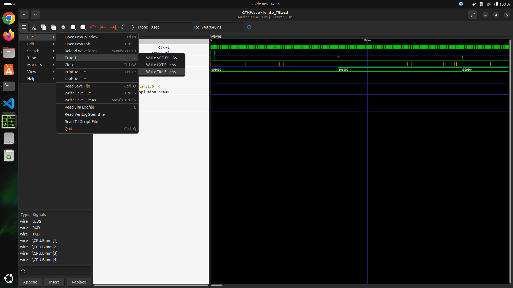
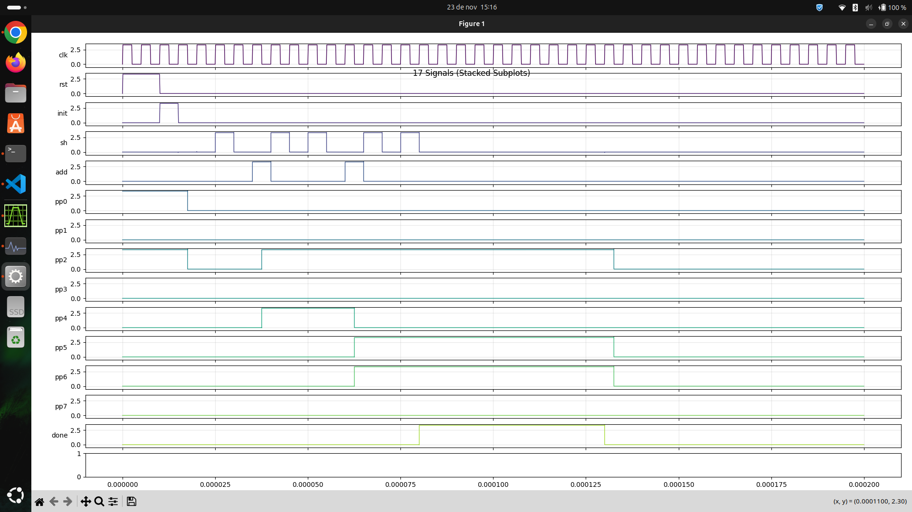
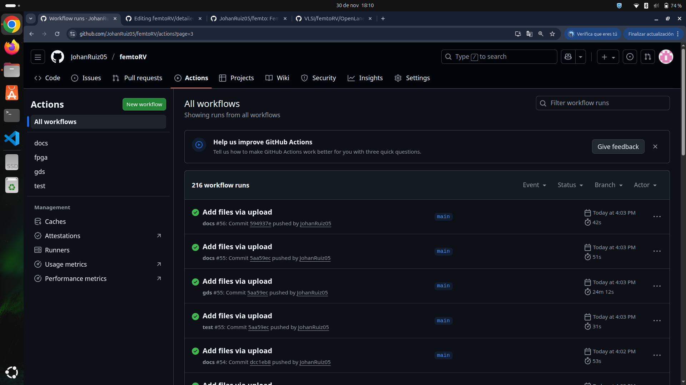
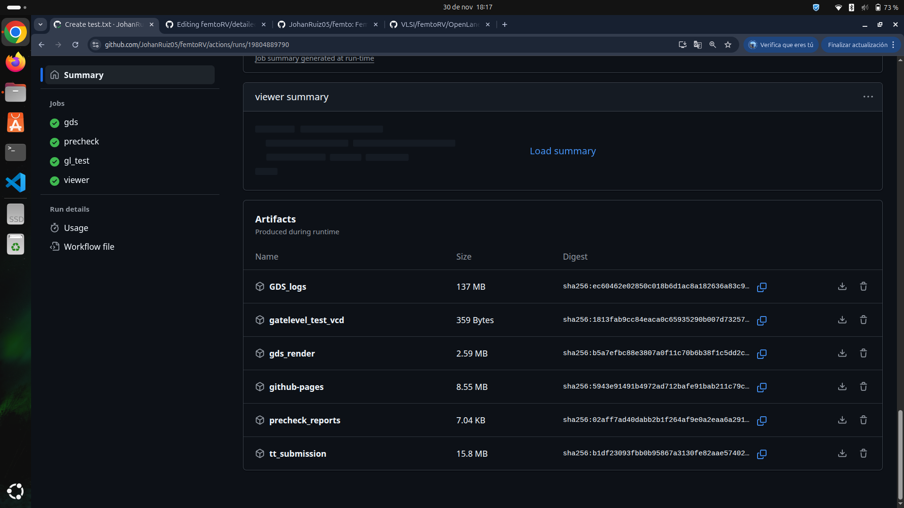

# Implementación de FemtoRV para Tiny Tapeout

A continuación se realiza una descripción del procedimiento llevado a cabo para la implementación del procesador RISC-V FemtoRV, basado en el desarrollo de Bruno Levy, a través de herramientas de diseño VLSI libres y open-source para su posterior envío al proyecto educativo Tiny Tapeout, que permite manufacturar un chip real a partir del desarrollo realizado. El diagrama de bloques del procesador propuesto se observa a continuación.


## Descripción general

Para que el procesador fue implementado inicialmente en Verilog, a través de diferentes módulos que aseguraban su funcionamiento. El módulo principal (top) es femto.v, que instancia la memoria y los diferentes periféricos necesarios. La memoria usaba la interfaz SPI (Serial Peripheral Interface) para la comunicación y contaba tanto con una memoria flash para el sistema (mappedSPIFlash.v), como una memoria RAM para el funcionamiento activo del procesador (mappedSPIRAM.v); mientras que como periféricos se tenía la UART, necesaria para verificar la correcta ejecución de las diferentes tareas en el procesador (uart.v). Adicionalmente, se tenían periféricos de prueba como el multiplicador, divisor, entre otros, que aunque se encuentran entre los archivos src, no fueron utilizados para disminuir el tamaño y complejidad del sistema.

Los archivos en Verilog de la implementación se pueden encontrar en la carpeta [femtoRV/src](../src). 

Para ver el flujo de diseño original, se puede consultar el GitHub [VLSI](https://github.com/cicamargoba/VLSI.git), en la carpeta femtoRV/OpenLane. Este contiene el femto.v inicial sin las adaptaciones necesarias para Tiny Tapeout, permitiendo ver de manera clara las entradas y salidas del procesador, así como el funcionamiento completo del sistema.  

## Herramientas necesarias 

### Flujo ASIC

Para la instalación de herramientas de flujo ASIC se puede seguir el README disponible en [VLSI](https://github.com/cicamargoba/VLSI/blob/main/README.md), donde se incluye:

1. Yosys -> Framework para Síntesis Verilog-RTL
2. Icarus Verilog -> COmpilador de Verilog para generar netlists 
3. GTKWave -> Visualizador de formas de onda (waveforms) compatible con formatos como VCD
4. NGSpice -> Simulador SPICE para circuitos analógicos, digitales y mixtos
5. OpenSTA -> Verificador de timing estático (STA) para gates
6. Magic -> Herramienta de EDA para diseño basado en VLSI
7. OpenLane -> Flujo automatizado que abarca desde RTL hasta GDSII, integrando herramientas como OpenROAD, Yosys, Magic, Netgen, KLayout, entre otras.
8. Docker -> Algunas partes del flujo de trabajo lo requieren

### Diseño de circuito

Por otra parte, es necesario instalar otras herramientas que permiten el diseño y simulación del sistema, correspondientes a OpenPDK, que habilita el uso de Sky130 para el diseño de circuitos integrados (y que es usado por Tiny Tapeout); y Xyce, un simulador de circuitos analógicos de alto rendimiento. 

9. OpenPDK

```bash
git clone git://opencircuitdesign.com/open_pdks
cd open_pdks
./configure --enable-sky130-pdk 
make
sudo make install
```

10. Xyce

```bash
git clone https://github.com/ChipFlow/Xyce-build.git
cd Xyce-build/
./build.sh 
sudo make install prefix=/usr/local
```

Los archivos de salida de OpenPDK pueden no ser leídos al ejecutar Xyce por guardarse con un nombre diferente durante la instalación. Para evitarlo, se puede renombrar la carpeta de salida como /.volare (generando una carpeta oculta).

## Flujo de trabajo

Para la síntesis del circuito a partir de los archivos en Verilog se usó iverilog, con la que se obtenían los archivos necesarios para la simulación inicial (como el .vcd). Las pruebas previas se realizaron con un Testbench para femto (femto_TB.v) y el uso de GTKWave, con el que se añadían las diferentes señales de interés para verificar su funcionamiento. La carpeta femtoRV en [VLSI](https://github.com/cicamargoba/VLSI.git) contiene los archivos generados tanto de hardware (.v) como de firmware (.hex), así como plantillas de GTKWave (.gtkw) para el análisis de las señales. La versión final con los archivos usados en simulación se encuentra en el respositorio [femto](https://github.com/JohanRuiz05/femto), con organización similar a VLSI.

### Síntesis

El flujo de diseño inicial se realiza a partir de OpenLane, que genera los resultados que se usaron para los pasos descritos. OpenLane toma los archivos disponibles en [femtoRV/OpenLane](https://github.com/cicamargoba/VLSI/tree/main/femtoRV/OpenLane), incluyendo los archivos fuente descritos, y automatiza el flujo, generando las carpetas final, floorplan, placement, routing y synthesis en la carpeta llamada OpenLane/designs/.../runs/full/results (... es el nombre dado en el comando, como se verá a continuación), donde se encuentran los archivos necesarios para los pasos posteriores. La carpeta OpenLane corresponde a la de origen del programa (generalmente llamada OpenLane y ubicada en donde fue instalada la herramienta). El comando a ejecutar dentro de la carpeta es:

```bash
make mount
./flow.tcl -design <design name> -init_design_config -add_to_designs 
```

Donde design name es el nombre que se quiera dar al proyecto, se usará como ejemplo femto. Una vez que ha sido ejecutado, se puede cambiar ligeramente el último comando para evitar la creación de múltiples ejecuciones en la carpeta, activando el parámetro overwrite para sobreescribir la carpeta creada anteriormente y mantener el orden. 

```bash
./flow.tcl -design <design name> -tag full_guide -overwrite 
```

### Manejo de Magic

Entre los archivos de salida en ../results, se puede destacar el .mag que contiene la carpeta ../results/final, que corresponde a la salida en Magic del circuito, el diagrama de compuertas del place and route. Al ser una representación física, es necesario convertirla a un formato que permita simularlo como es el caso de SPICE, lo que es posible dentro de la consola de Magic, ejecutando los comandos:

```bash
extract all
ext2spice cthresh 0 rthresh 0
ext2spice
```

Estos comandos extraen todo lo que contenga el layout, incluyendo las capacitancias parásitas, lo que puede generar archivos de gran tamaño que puedan ser difíciles de simular. Para evitar esto, el proceso puede realizarse añadiendo parámetros a la extracción:

```bash
ext2spice lvs
ext2spice cthresh infinite
ext2spice rthresh infinite
ext2spice subcircuit on
ext2spice hierarchy on
ext2spice scale off
ext2spice
```

El resultado del anterior proceso es un archivo .spice que puede ser usado para la simulación del circuito con Xyce o NGSpice, ubicándolo en la carpeta del proyecto.

### Simulación del diseño

Desde este punto se remitirá al respositorio [femto](https://github.com/JohanRuiz05/femto) para los archivos finales. Para el siguiente paso, se creó la carpeta /spice en femto, y dentro de esta una subcarpeta con el nombre del diseño (femtoRV/spice/femto). En esta se ubicó el archivo .spice generado, junto con los archivos generados con iverilog. Es importante mencionar que el flujo requiere varios archivos de sky_130 para funcionar, por lo que es necesario que estén incluidos en la carpeta de origen o que se apunte a ellos. Estos son:

- sky130_fd_sc_hd.v
- primitives.v

Con lo anterior, es necesario abrir el archivo de GTKWave y ubicar las señales de interés para la simulación en la pestaña de formas de onda. En el caso de /femto, se tenían cuatro señales necesarias: clk (clock del sistema), resetn (reset del sistema), spi_miso y spi_miso_ram (interfaces master input slave output). Para otros diseños pueden añadirse las necesarias. Una vez definidas, se elige la opción File -> Export -> Write TIM File as y se le da un nombre al archivo .tim, como se ve a continuación.



El resultado de este paso es un archivo .tim a partir del cual se puede generar el archivo .cir que recibe como entrada NGSpice o Xyce, y que contiene una representación de las señales a simular. Para la conversión se creó un script de Python (2_tim_to_pwl.py) que se encargaba de pasar los datos de .tim al formato .cir sin alterar los nombres de las señales y definiendo un epsilon para los cambios de estado de las señales. El parámetro epsilon era esencial para asegurar el funcionamiento del paso, ya que tiempos muy cortos (inferiores a 1e-09) ocasionaban errores en Xyce. Este parámetro, por lo tanto, es editable. El comando para ejecutar el script, asumiendo que está ubicado en femtoRV/spice (una carpeta antes), es:

```bash
python3 ../tim_to_pwl.py <tim filename>
```

La ejecución del script generaba un .cir del mismo nombre con las señales exportadas de GTKWave. El ejemplo para /femto se ve a continuación, donde se destacan como parámetros importantes el tiempo de simulación (.tran), que aumenta o reduce los recursos necesarios para la simulación, el llamado a las librerías SPICE de sky130 y el include del archivo .spice generado en el anterior paso.


Así, se completaban los archivos necesarios para la simulación. Se tenían dos opciones para correrlo, con sus comandos correspondientes:

* Con Xyce

```bash
mpirun -np <num. procs> Xyce <netlist filename>
```

* Con NGSpice

```bash
ngspice <netlist filename>
```

Lo que generaba como salida un archivo .raw que permitía la visualización de los resultados. Es importante mencionar que el tiempo de simulación dependía en gran medida del tamaño del archivo .spice, de la cantidad de señales del archivo .tim y de la complejidad del diseño. Para visualizar el archivo .raw, se generó otro script de Python (plot.py) que tomaba el resultado de la simulación (apuntaba al .raw generado) y, por medio de LTSpice, permitía graficarlo, para así comparar las dos simulaciones de diferentes etapas del proceso. El comando era:

```bash
python3 plot.py
```

En algunas distribuciones de Linux no existe LTSpice como aplicación para instalar, por lo que es necesario crear un entorno de Python para poder graficar el resultado. Los comandos para este fin son:

```bash
python3 -m venv <env name> #Solo se ejecuta una vez para crear el entorno, si ya existe se omite
source <env name>/bin/activate
pip install ltspice #Solo se ejecuta una vez para instalar LTSpice, si ya se realizó se omite
```

Un ejemplo de lo que debería verse en este paso se muestra en la siguiente imagen:



En el caso de femto, se presentaron problemas durante la simulación debido al tamaño del .spice. En la carpeta /spice de [femto](https://github.com/JohanRuiz05/femto/tree/main/spice) hay otras simulaciones, como mult_4 y mult_32 que funcionan adecuadamente para probar los pasos descritos.

## Tiny Tapeout

Para enviar el procesador diseñado a Tiny Tapeout fue necesario realizar una serie de cambios al código de origen para adaptarlo a los requerimientos de la plataforma, necesarios para su aceptación. El flujo de trabajo era automático desde Github, usando herramientas muy similares a las descritas hasta este paso. La plantilla usada para un diseño con sky se encuentra en [Tiny Tapeout](https://github.com/TinyTapeout/ttsky-verilog-template), donde se indican también los pasos necesarios para participar en el proyecto.

En los archivos de Verilog de origen únicamente se debía adaptar el módulo top, femto.v, que pasaba a ser tt_um_femto.v. El módulo final se puede ver en la carpeta [femtoRV/src](../src). Adicionalmente, se debían establecer explícitamente los parámetros de funcionamiento, archivos source y  pines de entrada y salida en el archivo [info.yaml](../info.yaml) y llenar algunos datos adicionales en [info.md](../docs/info.md). Con este procedimiento, y corrigiendo diferentes errores asociados principalmente a la sintaxis exigida por Tiny Tapeout, se completó el flujo de trabajo exigido para la recepción de trabajos, principalmente la ejecución con sky en el proceso gds, el más relevante de los procesos.

Se debe mencionar que uno de los pasos requería la adaptación de un testbench del diseño por medio de CocoTB, un framework basado en Python para verificar diseños en HDL, pero no se simuló ninguna salida en este para evitar errores asociados al tiempo de ejecución. El flujo de trabajo automático genera una serie de resultados que podían ser simulados directamente siguiendo un proceso similar al descrito anteriormente, por lo que se prefirió esta forma de verificar que el diseño enviado fuera correcto. Resumiendo:

- Proceso docs: Actualizar el archivo info.md en la carpeta [/docs](../docs) del proyecto con la información requerida.
- Proceso test: Actualizar los archivos [tb.v](../test/tb.v) con las señales del módulo top en Verilog; [test.py](../test/test.py) con ña instanciación de las señales para CocoTB y [Makefile](../test/Makefile) llamando a los diferentes módulos de Verilog necesarios para el funcionamiento del proyecto. Se pueden seguir los pasos descritos en el [README](https://github.com/JohanRuiz05/femtoRV/blob/main/test/README.md) de la plantilla.

La ejecución del proceso se puede ver en la sección Actions del repositorio, que brinda toda la información relevante y detallada de cada proceso, errores en caso de que se presenten y los resultados, tardando aproximadamente media hora en concluir (por acción de gds). Cada cambio activa automáticamente la acción de los tres procesos, que deben ser superados (cuadro en verde) para asegurar que el flujo es correcto. Para identificar errores, se puede descargar el archivo .zip generado en cada paso, que contiene los logs detallados del error.

### Simulación de resultados de Tiny Tapeout

Una vez que concluyen las acciones y todas son aceptadas, es posible remitirse a Actions y verificar los resultados. En la parte izquierda aparece un menú de los diferentes workflows ejecutados, donde se debe seleccionar gds al corresponder a los resultados de síntesis del proyecto, como se observa a continuación.



Seleccionando la última ejecución exitosa, se abre el resumen del proceso realizado (gds summary), el cual se puede consultar para mayor información del uso de recursos para las condiciones establecidas de diseño (uso de celdas, utilización de tutas, warnings, procesos de precheck, entre otros). La última sección, llamada Artifacts, contiene los resultados finales, permitiendo su descarga para el análisis. La simulación se realizó con la carpeta de salida tt_submission, como se puede ver.



La carpeta descargada (puede ser necesario descomprimirla) contiene los archivos src del diseño, así como una subcarpeta llamada tt_submission, donde se encuentra:

- tt_um_femto.gds
- tt_um_femto.lef
- tt_um_femto.spef (max, min y nom)
- tt_um_femto.oas
- tt_um_femto.v

A partir de los cuales es posible obtener el archivo .spice recordando los comandos descritos para la extracción de Magic (Manejo de Magic) usando el archivo tt_um_femto.gds, pero indicando de manera explícita el path de trabajo para Magic con:

```bash
export PDK_ROOT=/usr/local/share/pdk/
export PDK=sky130A
magic -T $PDK_ROOT/sky130A/libs.tech/magic/sky130A.tech tt_um_femto.gds
```

Posteriormente, se configura la extracción solo de dispositivos (sin parásitos), siguiendo los pasos de la sección de Manejo de Magic. El archivo resultante permite repetir los pasos descritos durante la simulación del diseño, ubicando todo en una carpeta llamada tt_um_femto dentro de femtoRV/spice; pero también se generan una serie de archivos .ext durante la extracción, estos no se emplearon. 

Repitiendo los pasos del procedimiento Simulación de diseño, se genera la simulación en GTKWave y se obtiene el archivo .tim, que posteriormente se convierte a .cir con el script de Python (2_tim_to_pwl). Adicionalmente, se adaptan los archivos Makefile y pLot.py para tt_um_femto, alcanzando los resultados ya descritos, y se realiza la compilación con iverilog. Los archivos finales de este proceso se encuentran en [femto](). El archivo de formas de onda resultante (a partir del .vcd generado) en GTKWave se observa a continuación, correspondiente al archivo tt_um_femto_sim_1.gtk.


Obteniendo la simulación de tiempo funcional. Los pasos siguientes (con Xyce o Ngspice) no pudieron ser replicados por la complejidad del circuito extraído, lo que impidió una simulación a nivel físico de la implementación de femto. SIn embargo, para comprobar que el proceso se había realizado de manera correcta, se repitió el proceso completo (implementación, simulación del diseño y prueba con Tiny Tapeout) ára un archivo ya comprobado de menor complejidad, un multiplicador de 4 bits. 

### Multiplicador de 4_bits

CAmbio exportación MAgic

Extracción

```bash
gds noduplicates
gds readonly true
extract do local
extract all
```

Creación .spice

```bash
ext2spice lvs
ext2spice cthresh infinite
ext2spice rthresh infinite
ext2spice subcircuit off
ext2spice hierarchy off
ext2spice scale off
ext2spice
```

Cambiar nombres de señales en el .cir a partir del .tim (a uio_in[0] por ejemplo) con el TB que tenía de antes, solo se necesita para generar los flancos. 
Copiar el .spice dentro del .cir, no incluir. 

Verificar los nombres de señales desde Python. 

Tardó 35 minutos simulando. 

Tiempo de simulación corto (hasta 2 us) para que concuerde con lo que se hizo en el TIM. 

LOs archivos de salida y eso eran los del tinytapeout, menos el TB que era de antes para facilitar el manejo. Por eso tocaba cambiar las señales del .cir antes de simular.

Editar el plot de python. 

Las señales de salida se instancian como en GTKWave llamándolas. La señal debe ser igual.

